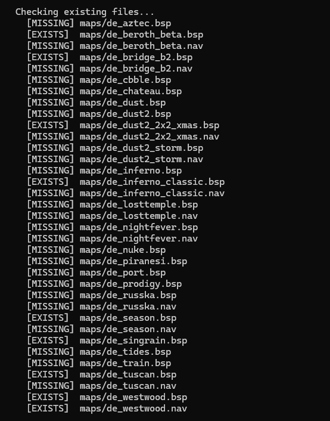
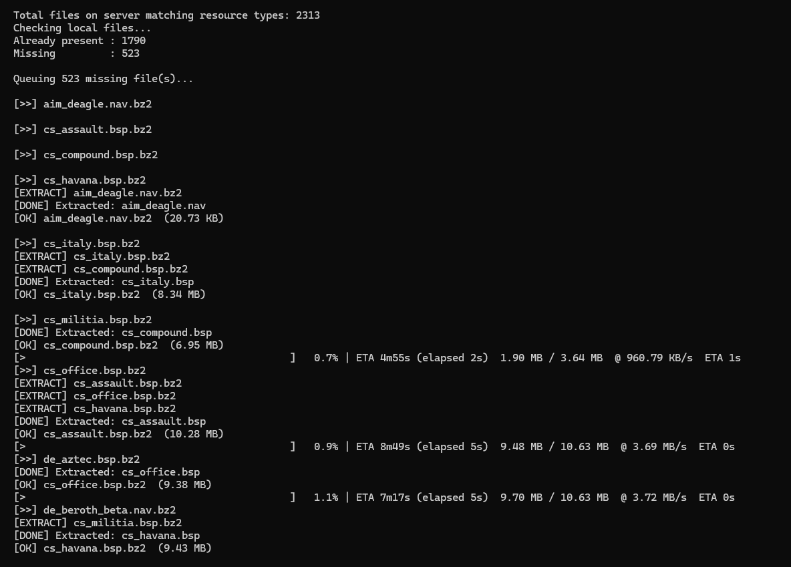
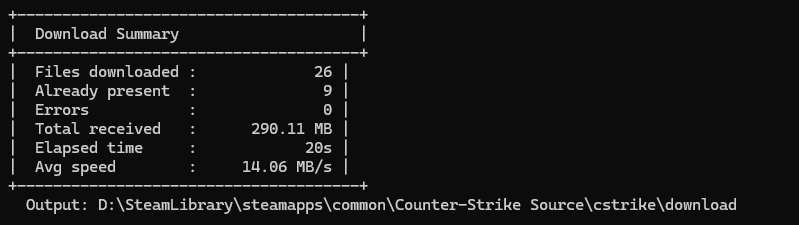

FastDL Tool · Game File Downloader · v1.2
Windows + Linux | MinGW / GCC | C++17
Author: SyntX · github.com/SyntX34/FastDLExtractor

A cross-platform CLI tool for syncing files from a FastDL server to your local game installation. Built for Source Engine games (CS:Source, Garry's Mod, TF2, …). Automatically decompresses .bz2 files, downloads in parallel, and only grabs what you're missing.

A **graphical frontend** (PyQt6) is also included and can be compiled into a single standalone executable for Windows, Linux, and macOS — no Python installation required on the target machine.

---

## Features

| Feature | Description |
|---------|-------------|
| **Smart sync** | Compares server file list against your local game folder — only downloads what's missing |
| **Folder crawl** | Point it at a directory on the FastDL server; it recursively lists every file. Use `folder/prefix*` to filter by prefix (e.g., `maps/zm_*`) |
| **Multi-threaded** | Configurable parallel workers (default: 4, max: 16) |
| **BZ2 auto-extract** | Fetches .bz2, decompresses, deletes the archive — fully transparent |
| **Fallback logic** | Tries .bz2 first, falls back to the plain file if not found |
| **Extension filter** | Only downloads the file types listed in `resource_types` |
| **Multiple servers** | One config file, unlimited server profiles |
| **Live progress** | Per-file speed, ETA, overall progress bar |
| **Static binary** | Windows build links everything statically — no DLL hell |
| **Unicode console** | UTF-8 manifest embedded — server names with special characters display correctly |
| **GUI frontend** | PyQt6 dark-themed desktop app, compiles to a single .exe/.bin with no runtime deps |

---

## Screenshots





---

## GUI Frontend

The graphical interface (`gui/fastdl_gui.py`) wraps the C++ backend via `ctypes` and provides:

- **Server manager** — add, edit, and remove server profiles in-app; no JSON editing needed
- **Download tab** — select a server, set threads, optionally enter a specific path, and hit Start
- **Live log** — colour-coded per-file status (downloading / extracting / error / done)
- **Dual progress bars** — current file and overall session
- **Settings tab** — configure the backend library path, default output directory, and thread count
- **Dark theme** — Catppuccin-inspired palette (matches the CLI aesthetic)

### Building the GUI executable

The build system is a three-step pipeline handled entirely by a single script:

```
Step 1: Build C++ shared library  (cmake → libfastdl.so / fastdl.dll)
Step 2: Install Python deps       (venv + pip install PyQt6 pyinstaller)
Step 3: PyInstaller               (→ dist/FastDLTool[.exe], single file)
```

The resulting binary bundles the C++ library and all Python dependencies inside itself. Copy it anywhere — no Python, no `.so`, no DLLs needed on the target machine.

---

#### Linux / macOS

**Prerequisites:**

```bash
# Debian / Ubuntu
sudo apt install cmake g++ libcurl4-openssl-dev libbz2-dev python3 python3-venv

# Fedora / RHEL
sudo dnf install cmake gcc-c++ libcurl-devel bzip2-devel python3

# Arch
sudo pacman -S cmake gcc curl bzip2 python

# macOS (Homebrew)
brew install cmake bzip2 curl python
```

**Build:**

```bash
chmod +x build_gui.sh
./build_gui.sh
```

Output: `dist/FastDLTool`

```bash
./dist/FastDLTool
```

---

#### Windows

**Prerequisites:**

- [CMake](https://cmake.org/download/) in your PATH
- One of:
  - **MSVC** — Visual Studio 2019/2022 with C++ workload (recommended)
  - **MinGW** — via [MSYS2](https://www.msys2.org/)
- Python 3.10+ in your PATH (`python --version` works)
- Git (for automatic vcpkg bootstrap)

**Build with MSVC (default) — run in Developer PowerShell for VS 2022:**

```powershell
.\build_gui.ps1
```

**Build with MinGW instead of MSVC:**

```powershell
.\build_gui.ps1 -UseMinGW
# or with a custom MinGW path:
.\build_gui.ps1 -UseMinGW -MinGWPath "C:\msys64\mingw64\bin"
```

**Custom vcpkg location:**

```powershell
.\build_gui.ps1 -VcpkgRoot "D:\tools\vcpkg"
```

Output: `dist\FastDLTool.exe`

```powershell
.\dist\FastDLTool.exe
```

---

#### Manual build (any platform)

If you prefer to drive each step yourself:

```bash
# 1. Build the C++ library
./build_lib.sh          # Linux/macOS
.\build_lib.ps1         # Windows PowerShell

# 2. Install Python deps
pip install PyQt6 pyinstaller

# 3. Run PyInstaller
pyinstaller fastdl_gui.spec --distpath dist --noconfirm --clean
```

---

#### PyInstaller spec (`fastdl_gui.spec`)

The spec file controls exactly what goes into the executable:

| Setting | Value | Notes |
|---------|-------|-------|
| `console` | `False` | No terminal window on launch |
| `binaries` | C++ `.so`/`.dll` | Bundled automatically by the spec |
| `hiddenimports` | PyQt6, ctypes, … | Ensures no missing module at runtime |
| `excludes` | numpy, matplotlib, … | Strips unused heavy packages |
| `upx` | `True` | Compresses the binary if UPX is installed |

To add a custom icon, place `gui/icon.ico` (Windows) or `gui/icon.icns` (macOS) in the project, then uncomment the `icon=` line in the spec.

---

#### What each build file does

| File | Platform | Purpose |
|------|----------|---------|
| `build_gui.sh` | Linux / macOS | Build C++ lib → venv → PyInstaller → `dist/FastDLTool` |
| `build_gui.ps1` | Windows | Build C++ DLL → venv → PyInstaller → `dist/FastDLTool.exe` |
| `fastdl_gui.spec` | All | PyInstaller recipe (library bundling, hidden imports, excludes) |
| `build_lib.sh` | Linux / macOS | Build C++ shared library only (no Python step) |
| `build_lib.ps1` | Windows | Build C++ DLL only (no Python step) |

---

## CLI Building

### Windows (MinGW-w64 / MSYS2)

**Prerequisites:**
- MinGW-w64 — via [MSYS2](https://www.msys2.org/) (recommended) or [standalone builds](https://github.com/niXman/mingw-builds-binaries/releases)
- CMake in your PATH
- bzip2 dev package

```bat
:: Install bzip2 inside MSYS2 MinGW shell
pacman -S mingw-w64-x86_64-bzip2

:: Configure (run from a normal cmd or PowerShell, not MSYS2 shell)
cmake -B build -G "MinGW Makefiles" -DCMAKE_BUILD_TYPE=Release ^
      -DCMAKE_C_COMPILER=C:\msys64\mingw64\bin\gcc.exe ^
      -DCMAKE_CXX_COMPILER=C:\msys64\mingw64\bin\g++.exe

:: Build
cmake --build build -j4
```

> **Note:** If your project folder path contains spaces (e.g. `D:\FastDL Extractor\`), CMake handles this automatically — no manual quoting needed.

Output: `build\FastDLTool.exe` — fully static, no external DLLs required.

### Linux

```bash
# Debian / Ubuntu
sudo apt install cmake g++ libcurl4-openssl-dev libbz2-dev

# Fedora / RHEL
sudo dnf install cmake gcc-c++ libcurl-devel bzip2-devel

# Arch
sudo pacman -S cmake gcc curl bzip2

# Build
cmake -B build -DCMAKE_BUILD_TYPE=Release
cmake --build build -j$(nproc)
```

---

## Configuration

On first run, the tool generates an example `configs/servers.json`. Edit it before running again.

### Full example

```json
{
    "global_game_path": "",
    "servers": [
        {
            "id": "css_server1",
            "name": "CS:Source - My Server",
            "fastdl_url": "https://fastdl.example.com/cstrike/",
            "game_path": "C:/Program Files (x86)/Steam/steamapps/common/Counter-Strike Source/cstrike/download",
            "resource_types": [
                ".bsp", ".nav",
                ".mdl", ".dx80.vtx", ".dx90.vtx", ".sw.vtx", ".vvd", ".phy",
                ".vtf", ".vmt",
                ".wav", ".mp3",
                ".pcf"
            ]
        }
    ],
    "download_paths": {
        "css_server1": [
            "maps/",
            "materials/",
            "models/",
            "sound/"
        ]
    }
}
```

### Config field reference

| Field | Type | Description |
|-------|------|-------------|
| `id` | string | Unique key for this server — must match the key in `download_paths` |
| `name` | string | Display name shown in menus and logs |
| `fastdl_url` | string | Base URL of your FastDL HTTP server (trailing `/` optional) |
| `game_path` | string | Local path where downloaded files are written |
| `resource_types` | array | File extensions to allow. Empty = allow everything |
| `download_paths` | object | Per-server list of paths to download (see modes below) |

---

## Download Modes

The tool supports three ways to tell it what to download. They can be mixed freely inside the same `download_paths` list.

---

### Mode 1 — Folder sync `"folder/"`

Specify a directory path ending with `/`. The tool will:

1. Fetch the FastDL server's HTML directory listing for that folder
2. Recursively follow sub-directories
3. Filter results by `resource_types`
4. Compare the full list against your local `game_path`
5. Download only the files that are missing locally

```json
"download_paths": {
    "css_server1": [
        "maps/",
        "materials/",
        "models/",
        "particles/",
        "sound/"
    ]
}
```

**Best for:** keeping your entire game installation in sync with the server. Run it any time new content is added — it will only fetch what you don't already have.

> Requires the FastDL server to have directory listing enabled (nginx `autoindex on;` or Apache `Options +Indexes`).

---

### Mode 2 — Prefix filter `"folder/prefix*"` 

Specify a directory path ending with `/` and a prefix filter ending with `*`. The tool will:
1. Fetch the FastDL server's HTML directory listing for that folder
2. Filter results by `resource_types` and the given prefix (files must start with the prefix)
3. Compare the full list against your local `game_path`
4. Download only the files that are missing locally

```json
"download_paths": {
    "css_server1": [
        "maps/zm_*",
        "models/v_*"
    ]
}
```

**Best for:** downloading only specific subsets of files (e.g., only zm_ maps or only v_ models).

---

### Mode 3 — Specific files `"path/to/file.ext"`

List exact relative file paths. Each one is checked locally before queuing — already-present files are skipped automatically (unless `-f` / `--force` is used).

```json
"download_paths": {
    "css_server1": [
        "maps/de_dust2.bsp",
        "maps/de_inferno.bsp",
        "maps/de_nuke.bsp",
        "materials/custom/my_texture.vtf",
        "sound/ambient/my_sound.mp3"
    ]
}
```

**Best for:** known file lists, when the server doesn't have directory listing enabled, or when you only want a specific subset of content.

---

### Mode 4 — Mixed

Folders, prefix filters, and files can coexist in the same list. Duplicates across all types are de-duplicated automatically.

```json
"download_paths": {
    "css_server1": [
        "maps/",
        "models/weapons/v_knife_ct.mdl",
        "sound/ui/playerping.wav"
    ]
}
```

---

### No `download_paths` configured

If `download_paths` is empty or absent for a server, the tool prints a hint and exits cleanly — nothing is downloaded silently.

```
  No download paths configured.
  Hint: use  -d "maps/de_dust2.bsp"  to download a specific file,
        or   -d "maps/"              to sync an entire folder,
        or add paths to download_paths.css_server1 in configs/servers.json
```

---

## CLI Usage

```
FastDLTool [OPTIONS]

  -c, --config  <path>   Config file         (default: configs/servers.json)
  -s, --server  <index>  Server index 0-N    (skips interactive selection)
  -d, --download <path>  Single file or folder to download (overrides config)
  -o, --output  <dir>    Output directory    (default: game_path from config)
  -t, --threads <n>      Download threads    (default: 4, max: 16)
  -f, --force            Re-download even if file already exists locally
  -h, --help             Show this help
  -v, --version          Version info
```

### Examples

```bash
# Interactive — pick server from list, uses download_paths from config
FastDLTool

# Sync missing files for server 0 (non-interactive)
FastDLTool -s 0

# Sync with 8 parallel threads
FastDLTool -s 0 -t 8

# Download one specific file (missing-file check still applies)
FastDLTool -s 0 -d maps/de_dust2.bsp

# Crawl and sync an entire folder from the CLI (no config edit needed)
FastDLTool -s 0 -d maps/

# Only download zm_* maps from the maps folder
FastDLTool -s 0 -d maps/zm_*

# Force re-download everything, ignoring local files
FastDLTool -s 0 -f

# Force re-download a specific folder
FastDLTool -s 0 -d maps/ -f

# Use a different config and output directory
FastDLTool -c ~/servers.json -s 1 -o ~/Downloads/fastdl
```

### Exit codes

| Code | Meaning |
|------|---------|
| `0` | All files downloaded successfully (or nothing to do) |
| `1` | Config error or bad arguments |
| `2` | One or more files failed after all retries |

---

## How BZ2 decompression works

FastDL servers compress files as .bz2 (e.g. `de_dust2.bsp` → `de_dust2.bsp.bz2`).

```
Request: de_dust2.bsp
   └─ Try:  https://fastdl.example.com/.../de_dust2.bsp.bz2
        ├─ 200 OK  → download → decompress → de_dust2.bsp  ✓
        └─ 404     → try plain de_dust2.bsp
                       ├─ 200 OK  → download as-is  ✓
                       └─ 404     → error after N retries  ✗
```

Decompression is **streaming** — no file size limit, minimal memory overhead.

---

## Project structure

```
FastDLTool/
├── CMakeLists.txt
├── README.md
├── fastdl_gui.spec               PyInstaller recipe for the GUI executable
├── build_gui.sh                  Full GUI build: C++ lib + Python exe (Linux/macOS)
├── build_gui.ps1                 Full GUI build: C++ DLL + Python exe (Windows)
├── build_lib.sh                  C++ shared library only (Linux/macOS)
├── build_lib.ps1                 C++ shared library only (Windows)
├── readme/
│   └── images/
│       ├── image.png
│       ├── image1.png
│       └── image3.png
├── src/
│   ├── main.cpp                  CLI entry, argument parsing, progress UI
│   ├── FastDLDownloader.h/.cpp   Thread pool, HTTP (WinHTTP / libcurl), BZ2
│   ├── ConfigManager.h/.cpp      JSON config load / save
│   ├── fastdl_capi.h/.cpp        Plain-C bridge exposed by the shared library
│   ├── ProgressBar.h             Animated progress bar renderer
│   └── Utils.h                   formatBytes / formatSpeed / formatDuration
├── gui/
│   ├── fastdl_gui.py             PyQt6 GUI frontend (calls C++ lib via ctypes)
│   ├── fastdl.dll                (Windows – generated by build_gui.ps1)
│   ├── libfastdl.so              (Linux   – generated by build_gui.sh)
│   └── libfastdl.dylib           (macOS   – generated by build_gui.sh)
├── dist/
│   ├── FastDLTool.exe            (Windows – generated by build_gui.ps1)
│   └── FastDLTool                (Linux/macOS – generated by build_gui.sh)
└── third_party/
    └── nlohmann/
        └── json.hpp              Single-header JSON library (no extra deps)
```

---

## License

MIT — see [LICENSE](LICENSE) for details.

---

*Made by [SyntX](https://github.com/SyntX34)*
